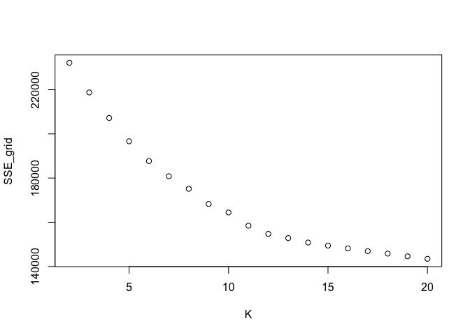

Customer Segmentation - Case study
================

This is a typical consulting problem, where a business wants to understand the different types of customers it has based on their tweeting history for the purpose of __targeted marketing__. In this report, I will analyze the data and present my recommendations about the different types of customers that I could discover from this dataset. More information about the dataset can be found at the end of this report in the "Appendix".

# About me

Hi! I'm __Apoorv Mehrotra__, a graduate student at __McCombs Business School, UT Austin__, currently pursuing my __Master's of Science in Business Analytics__. I have a deep rooted interest in solving problems and storytelling. I have 1 year of experience in Retail analytics which gave me a stronghold on tools like SQL, Python, R, Google BigQuery, MS Excel etc. I joined this Master's program to deepen my knowledge of Statistical concepts that form the fundamentals of analytical problem solving and to sharpen my storytelling skills so that I can help businesses extract maximum value from these concepts without them having to dive deep into the math behind the scenes.

I am interested in roles that involve translation of business problems into mathematically/statistically solvable problems, and to provide __actionable insights__ that can help my clients and stakeholders reap the rewards of their investment in me.

# The goal

“NutrientH20” (pseudonym) wants to understand its social-media audience
a little bit better, so that it could hone its messaging a little more
sharply.

## Assumptions

For the sake of this analysis (based on the pseudonym) we will
**consider NutrientH20 as a nutrient water brand which is entering the
market of flavoured electrolytes**.

# Approach

1.  Identify scope+context of problem (goal+assumptions)
2.  Data normalisation
3.  Hypotheses creation
4.  Hypotheses testing
    1.  KNN Clustering
    2.  PCA
    3.  Cluster Identification
5.  Recommendation

# Data pre-processing

We have a dataset that includes 36 tweet categories for 7882 users,
where each cell represents how many times each user has posted a tweet
that can be tagged to that category. Categories include the following:

| x                 |
| :---------------- |
| adult             |
| art               |
| automotive        |
| beauty            |
| business          |
| chatter           |
| college\_uni      |
| computers         |
| cooking           |
| crafts            |
| current\_events   |
| dating            |
| eco               |
| family            |
| fashion           |
| food              |
| health\_nutrition |
| home\_and\_garden |
| music             |
| news              |
| online\_gaming    |
| outdoors          |
| parenting         |
| personal\_fitness |
| photo\_sharing    |
| politics          |
| religion          |
| school            |
| shopping          |
| small\_business   |
| spam              |
| sports\_fandom    |
| sports\_playing   |
| travel            |
| tv\_film          |
| uncategorized     |

## Data normalisation

As with any problem where the columns are similar items with values as
frequency of occurence (typical text analytics base data), we calculate
the term frequencies as % of tweets tagged to a category per user. This
normalises for the difference in number of tweets per user, giving us an
intuition of weightage of a category in the tweet profile for the
user.

<!-- -->

## Outlier removal

We look at the 4 unwanted categoies - **chatter**, **uncategorized**,
**adult** and **spam** and see the % of data filtered when we set a
range of cutoffs on the term frequency of that particular category for
every user.

1.  Chatter

| TF\_Chatter |     % Data |
| ----------: | ---------: |
|          15 | 30.4237503 |
|          20 | 17.2925653 |
|          25 |  9.0332403 |
|          30 |  4.2375032 |
|          35 |  1.8015732 |
|          40 |  0.6470439 |

2.  Adult

| TF\_Adult |    % Data |
| --------: | --------: |
|        10 | 3.9583862 |
|        15 | 2.5881756 |
|        20 | 1.5478305 |
|        25 | 0.8754123 |
|        30 | 0.4694240 |
|        35 | 0.1776199 |
|        40 | 0.0380614 |
|        45 | 0.0253743 |
|        50 | 0.0000000 |

3.  Spam

| TF\_Spam |    % Data |
| -------: | --------: |
|        1 | 0.5962954 |
|        6 | 0.0380614 |
|       11 | 0.0000000 |

4.  Uncategorized

| TF\_Uncat |    % Data |
| --------: | --------: |
|        10 | 2.4993656 |
|        13 | 1.0910936 |
|        16 | 0.5709211 |
|        19 | 0.2537427 |
|        22 | 0.1268714 |
|        25 | 0.0507485 |
|        28 | 0.0380614 |
|        31 | 0.0253743 |
|        34 | 0.0253743 |
|        37 | 0.0126871 |
|        40 | 0.0000000 |

We identified the following cutoffs dfor outliers our base data:

1.  chatter\>0.25 (9%)
2.  adult\>0.20 (1.5%)
3.  spam\>0.01 (0.6%)
4.  uncategorized\>0.16 (0.57%)

We also checked for mutual exclusivity of these rows (max data loss if
all are Mutually Exclusive) and for that if we remove rows with these
features, we lose about 12-13% of the data, which seems like a practical
enough trade off for removing a lot of noise from the, mainly due to
these 4 columns

### Why these columns?

1.  Chatter and uncategorized tweets will anyway not help in clustering,
    their correlation with any field is being assumed as a coincidence
2.  Spam and adult are categories that we do not want in our clusters

# Customer Segments - Intuition (Hypothesis)

## Correlated categories

When we looked at the set of categories, we expected some categories to
have a strong correlation - eg. personal\_fitness & health\_nuitrition
seem intuitively correlated. To set a cutoff, we looked at the number of
pairs that made the different cutoffs for correlation.

| Correlation Cutoff | Pair Counts |
| -----------------: | ----------: |
|               0.50 |          23 |
|               0.55 |          17 |
|               0.60 |          11 |
|               0.65 |           6 |
|               0.70 |           3 |
|               0.75 |           2 |
|               0.80 |           1 |
|               0.85 |           0 |
|               0.90 |           0 |

| Var1              | Var2              |      Freq |
| :---------------- | :---------------- | --------: |
| personal\_fitness | health\_nutrition | 0.8099024 |
| college\_uni      | online\_gaming    | 0.7728393 |
| fashion           | cooking           | 0.7214027 |
| beauty            | cooking           | 0.6642389 |
| politics          | travel            | 0.6602100 |
| parenting         | religion          | 0.6555973 |
| religion          | sports\_fandom    | 0.6379748 |
| fashion           | beauty            | 0.6349739 |
| outdoors          | health\_nutrition | 0.6082254 |
| parenting         | sports\_fandom    | 0.6077181 |
| computers         | travel            | 0.6029349 |

Shown above are the number of unique pairs of categories that made the
cut above a certain correlation value. 11 seems to be a reasonable
number to compare - let’s take a look at the categories with
correlation\>0.60, which we can expect to see together as the features
of the clusters we are going to create.

By looking at these pairs, we feel that we should look for 5 broad
clusters of customers:

## 1\. The fit ones

**personal\_fitness**, **health\_nutrition** come with the highest
correlation of 0.8, followed by the pair of **health\_nutrition** and
**outdoors** with a correlation of 0.6. We expect our first category to
be populated by people who are fitness-oriented and focus on keeping a
healthy lifestyle.. We are not sure about any age-based demographics for
this cluster as of now.

## 2\. Gen X

**parenting**, **religion** and **sports\_fandom** - all 3 categories
have correlation of ~0.60 between them (all 3 unique pairs) which hint
at a uniform association among all three. We are assuming Gen X (people
aged 39-54) to fall in this category.

## 3\. The Instagrammers

**Beauty**, **Cooking** and **fashion** - all 3 categories are
correlated reasonable well with each other with values ranging from
0.63-0.72, hinting at an association among the 3. While these people
might not be focused on a healthy lifestyle in terms of exercise and
eating right, they are focused on how they look, what they eat - which
in this day and age of social media hints at the one stop shop for
sharing the perfect reel life.

## 4\. The centennial gamer

We see one particular pair (**college\_uni** and **online\_gaming**)
with a high correlation of 0.77, which hits at the age group between
later teens and early 20s.

## 5\. Politics and Travel?

We don’t know what to call this category yet - the intersection of
politics and travel is unique yet not uncommon. Politically aware people
who like to travel, social workers, stand-up comedians, legal
consultants, management consultants - there are many people who are
likely to tweet about both of these categories. Let’s hope our
clustering exercise helps us understand these people better.

# Hypothesis testing

## Clustering using KNN

We perform z-scoring on our TF dataset and create a grid for number of
clusters in KNN to see where the elbow comes in our curve (to decide k
for KNN)

<!-- -->

Clearly, there is no clear edge - we will go ahead with our range of k
in \[3,6\] for clustering based on our hypothesis. Clustering will help
us put our individual customers in separate groups based on similarities
in their tweeting patterns.

## Principal Component Analysis

Principal Component Analysis (PCA) will help us understand the
composition of each point as an aggregation of the different numbers and
types of tweets made by each point. We will consider only the first two
pricipal components.

## PCA and KNN

We will now compare the results of KNN and PCA. Steps:

1.  Plot each point on the PCA plot - the plot will tell us where each
    point lies based on it’s composition of different number and types
    of tweets.
2.  Color of each point will be displayed based on cluster assigned to
    that point in KNN
3.  This will help us understand if customers from a particular cluster
    tend to tweet more about any specific topic(s).

Different plots from KNN look
like:

<!-- --><!-- --><!-- --><!-- -->

Looking at how PC1 and PC2 are formed in terms of categories:

<!-- -->

We can see 5 clusters - let’s look at our data points coloured in 5
clusters
again:

<!-- -->

## Cluster Identification

Comparing plots for both categories along PC1 and PC2, we can identify
the 5 segments

#### 1\. The fit ones

**personal\_fitness**, **health\_nutrition** and **outdoors** appear
close by between PC1=\[-0.2,-0.1\] and PC2=\[-0.45,-0.3\]

#### 2\. The Instagrammer

Going slightly wider on PC1 and a little up on PC2, we reach **Beauty**,
**Cooking** and **fashion** - all 3 categories lying between the younger
age reflecting categories like **college\_uni**, **online\_gaming**,
**photo\_sharing** and fitness focused **personal\_fitness**,
**health\_nutrition**, **outdoors**. We can consider these people active
on social media and aware of their looks and food.

#### 3\. The net-savvy student

Further up PC2 on similar PC1 range as the 2 clusters above,
**college\_uni** and **online\_gaming** interact with other categories
that net-savvy high school and college students are likely to tweet
about like **shopping**, **tv\_film**, **sports\_playing** etc.

#### 4\. The aware traveller

After observing **politics** and **travel** land near **news**, we can
take 1 step closer to identifying this cliuster as aware travellers who
keep up with current events, tv, film and computers. These are likely to
be working professionals that have travelling jobs.

#### 5\. The homely parents (Gen X)

**parenting**, **religion** and **sports\_fandom** - all 3 categories
appear on the far right along PC1, right after **food**, **school** and
**family**. Reflects traits and interests of traditional American
parents - sports, religion, food, family, school and the most obvious,
parenting.

# Recommendations

#### 1\. The fit ones

Appeal to the importance of electrlytes in a balanced diet and how they
help achieve fitness goals.

#### 2\. The Instagrammer

These people can be approached for collabs as marketing opportunities
where both parties end-up in a win-win situation.

#### 3\. The net-savvy student

Appeal to this being as an easy, all-in-one solution to carry around
campus to stay hydrated and enjoy flavoured, non-fattening drinks at the
same time.

#### 4\. The aware traveller

Travelling takes a toll on the body - place this item at popular ports
of travel and advertise the advantages of staying hyrated while
travelling. These can include better sleep, prevention of ear-blockage
during take-offs and landings or change in altitude in general.

#### 5\. The homely parents (Gen X)

Display the product in the light of a healthy alternative to sodas for
their children - delivering great taste AND replacement. This is the new
party drink\!

# Appendix

## Data collection and preparation

The data in [social\_marketing.csv](social_marketing.csv) was collected
in the course of a market-research study using followers of the Twitter
account of a large consumer brand that shall remain nameless—let’s call
it “NutrientH20” just to have a label.

A bit of background on the data collection: the advertising firm who
runs NutrientH20’s online-advertising campaigns took a sample of the
brand’s Twitter followers. They collected every Twitter post (“tweet”)
by each of those followers over a seven-day period in June 2014. Every
post was examined by a human annotator contracted through [Amazon’s
Mechanical Turk](https://www.mturk.com/mturk/welcome) service. Each
tweet was categorized based on its content using a pre-specified scheme
of 36 different categories, each representing a broad area of interest
(e.g. politics, sports, family, etc.) Annotators were allowed to
classify a post as belonging to more than one category. For example, a
hypothetical post such as “I’m really excited to see grandpa go wreck
shop in his geriatic soccer league this Sunday\!” might be categorized
as both “family” and “sports.” You get the picture.

Each row of [social\_marketing.csv](social_marketing.csv) represents one
user, labeled by a random (anonymous, unique) 9-digit alphanumeric code.
Each column represents an interest, which are labeled along the top of
the data file. The entries are the number of posts by a given user that
fell into the given category. Two interests of note here are “spam”
(i.e. unsolicited advertising) and “adult” (posts that are pornographic,
salacious, or explicitly sexual). There are a lot of spam and
pornography [“bots” on
Twitter](http://mashable.com/2013/11/08/twitter-spambots/); while these
have been filtered out of the data set to some extent, there will
certainly be some that slip through. There’s also an “uncategorized”
label. Annotators were told to use this sparingly, but it’s there to
capture posts that don’t fit at all into any of the listed interest
categories. (A lot of annotators may used the “chatter” category for
this as well.) Keep in mind as you examine the data that you cannot
expect perfect annotations of all posts. Some annotators might have
simply been asleep at the wheel some, or even all, of the time\! Thus
there is some inevitable error and noisiness in the annotation process.
